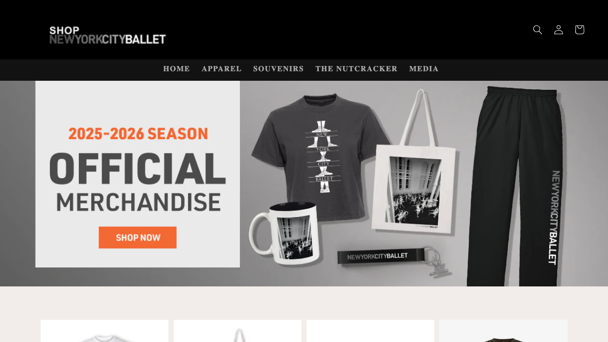
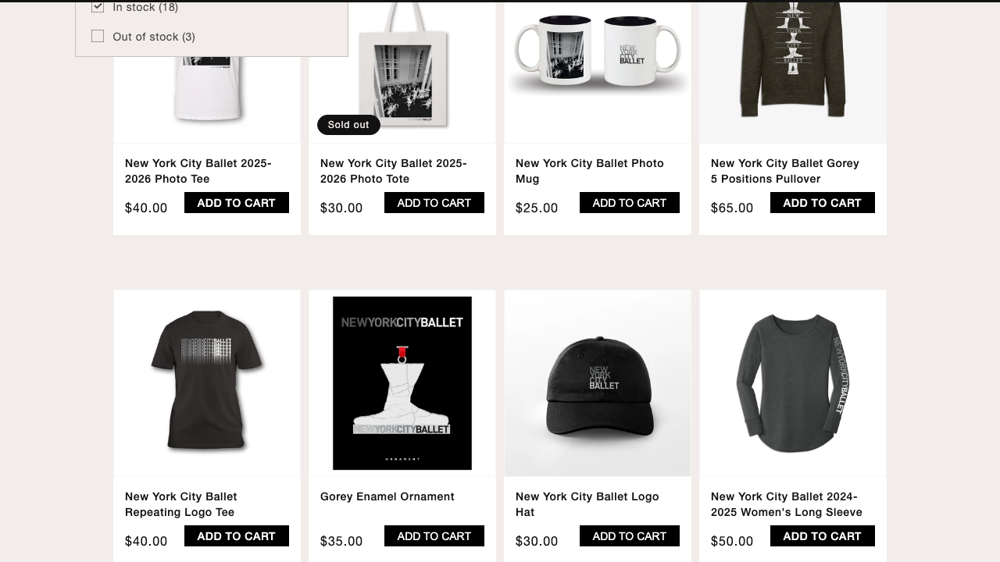

# NYC Ballet Shop - Playwright UI Tests


Automated UI testing project for the NYC Ballet Shop website using Playwright and TypeScript.

## Project Overview

This project demonstrates automated end-to-end UI testing of an e-commerce website using the Page Object Model (POM) design pattern.

**Website:** https://shop.nycballet.com/

## Tech Stack

- Playwright
- TypeScript
- JavaScript
- Page Object Model (POM)
- VS Code
- Git & GitHub

## Project Structure

```text
pages/
│
├── HomePage.ts
├── CollectionPage.ts
└── ProductPage.ts

tests/
│
└── nycb.spec.ts

playwright.config.ts
package.json
tsconfig.json
```
## Test Coverage

### Positive Test Cases

#### Product Listing
- Verify homepage loads successfully
- Verify logo is displayed
- Verify navigation menu is visible
- Verify product collection page opens
- Verify product cards are displayed

#### Product Sorting
- Verify user can sort products by Best Selling
- Verify sorting functionality

#### Product Filtering
- Verify user can filter products by availability
- Verify filtered results

### Negative Test Cases

- Verify product without a name is not displayed
- Verify product with missing image is not displayed
- Verify out of stock product cannot be added to cart
- Verify incorrect currency symbols are not displayed
- Verify duplicate products are not displayed

## How to Run Tests

Install dependencies:

```bash
npm install
```

Run all tests:

```bash
npx playwright test
```

Run tests in headed mode:

```bash
npx playwright test --headed
```

Open HTML report:

```bash
npx playwright show-report
```

## Design Pattern

This project follows the Page Object Model (POM) pattern:

- HomePage
- CollectionPage
- ProductPage

This approach improves maintainability, readability, and scalability of automated tests.

## Screenshots

### Logo Verification


### Caret Icon Verification


## Author

Oybek Tashpulatov

QA Automation Engineer
